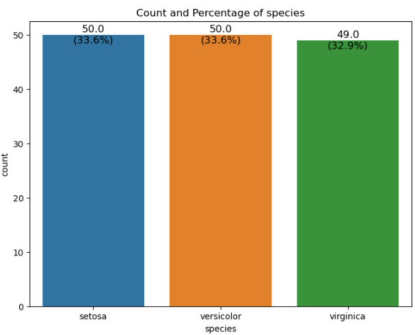
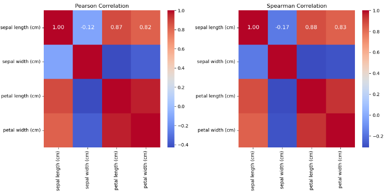
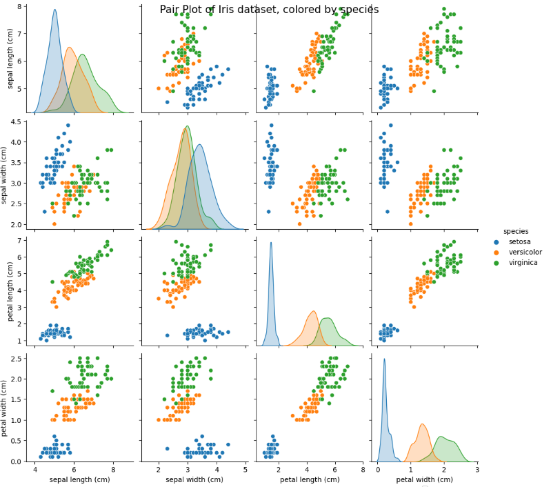
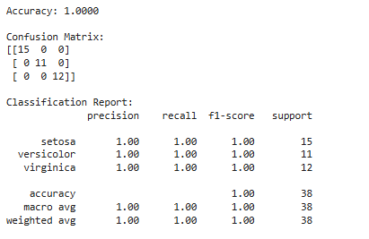
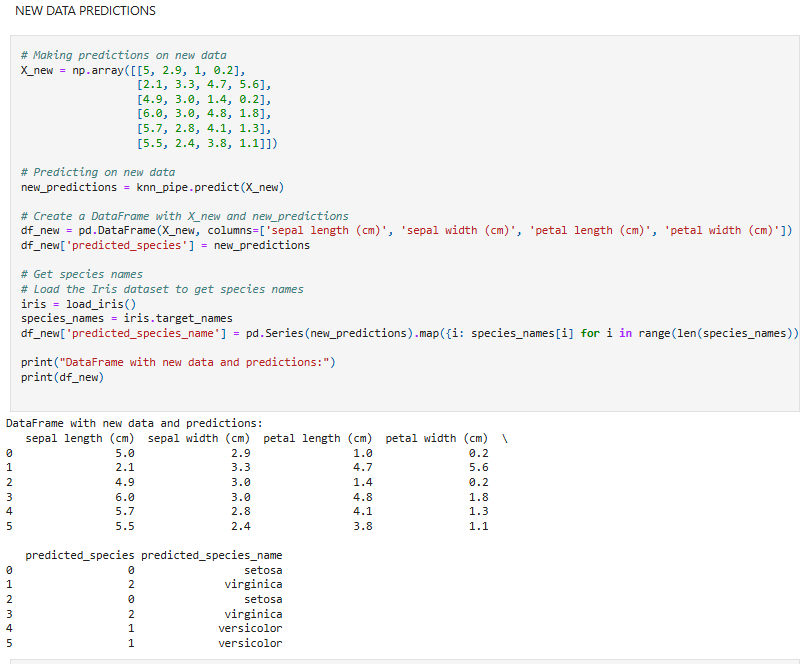

# Module_11-K-Nearest-Neighbors-KNN-algorithm

***Classifying multi-category iris flowers using the K-Nearest Neighbors (KNN) algorithm***  

***Business Understanding:***

Botanists require reliable methods to differentiate between species of flowers. Machine learning models can learn from measurements of known species to predict the species of new flowers. In this study, the Iris flower dataset is utilized.

***Objective:*** Develop a machine learning model to classify iris flowers into three species based on their measurements: Setosa, Versicolour, and Virginica.

***Data Understanding:***
***Dataset:*** The Iris dataset includes measurements (sepal length, sepal width, petal length, petal width) of three species of iris flowers. 
* ***Attributes:*** Four numerical attributes and a categorical target variable (species).

***Data Preparation:***  
* ***Data Cleaning:*** Addressed missing values and removed duplicated records.  
* ***Feature Selection:*** All four attributes were deemed relevant for classification.  
* ***Data Transformation:*** Categorical variables (species) were encoded into numerical labels.  
* ***Data Split:*** The dataset was split into training (75%) and testing (25%) sets after shuffling.  
* ***Visualizations:*** Utilized pair plots for feature exploration, and confusion matrix for model understanding.

***Modeling:***
* ***Technique:*** Employed the K Nearest Neighbors (KNN) algorithm for classification. 
* ***Parameter Tuning:*** Used GridSearch cross-validation to find the optimal number of neighbors (K) that minimized validation error (K=7).

***Evaluation:***
* ***Model Evaluation Metrics:*** Assessed accuracy, precision, recall, and F1-score to understand model performance.

* ***Deployment:*** Integration: Identified the best-fitting model ready for deployment. 
* ***Monitoring:*** Planned to monitor model performance and consider retraining based on performance metrics.

***Findings:***
The evaluation metrics suggest an excellent performance of the KNN model on the test dataset.

Accuracy measures the proportion of correctly predicted instances (both true positives and true negatives) out of the total number of instances. An accuracy of 1.00 (or 100%) indicates that the model predicted all instances in the test set correctly.

The confusion matrix provides a tabular representation of predicted vs. actual classifications. The rows represent the actual classes (setosa, versicolor, virginica), while columns represent the predicted classes. The diagonal elements (from top-left to bottom-right) represent the number of correctly classified instances for each class while the off-diagonal elements represent misclassifications. In this case: setosa: All 15 instances in the test set were correctly classified as setosa. versicolor: All 11 instances in the test set were correctly classified as versicolor. virginica: All 12 instances in the test setwere correctly classified as virginica.

***Classification Report:*** 
* ***Precision:*** Indicates the proportion of true positive predictions out of all positive predictions made. 
* ***Recall:*** Indicates the proportion of true positive predictions out of all actual positives. 
* ***F1-score:*** Harmonic mean of precision and recall, providing a balance between them.  
* ***Support:*** Number of instances for each class in the test set.

***Interpretation:*** Precision, Recall, and F1-score: All metrics are perfect (1.00) for each class, indicating that the model achieved flawless precision, recall, and F1-score for each class. 
* ***Accuracy:*** The model correctly classified all instances in the test set (38 out of 38), resulting in an accuracy of 100%. Macro avg and Weighted avg: Both metrics also show perfect scores (1.00) across all classes, indicating that the model's performance is consistent and excellent across all classes.

***Conclusion:*** The KNN model exhibits outstanding performance on the test dataset, achieving perfect accuracy and classification metrics. This suggests that the model is well-suited for the multi-category classification task on the Iris dataset, with no errors in prediction across the three classes (setosa, versicolor, virginica).

## Graphs

Here are some graphs related to the study:

You can also [view the graphs here](graphs/).
